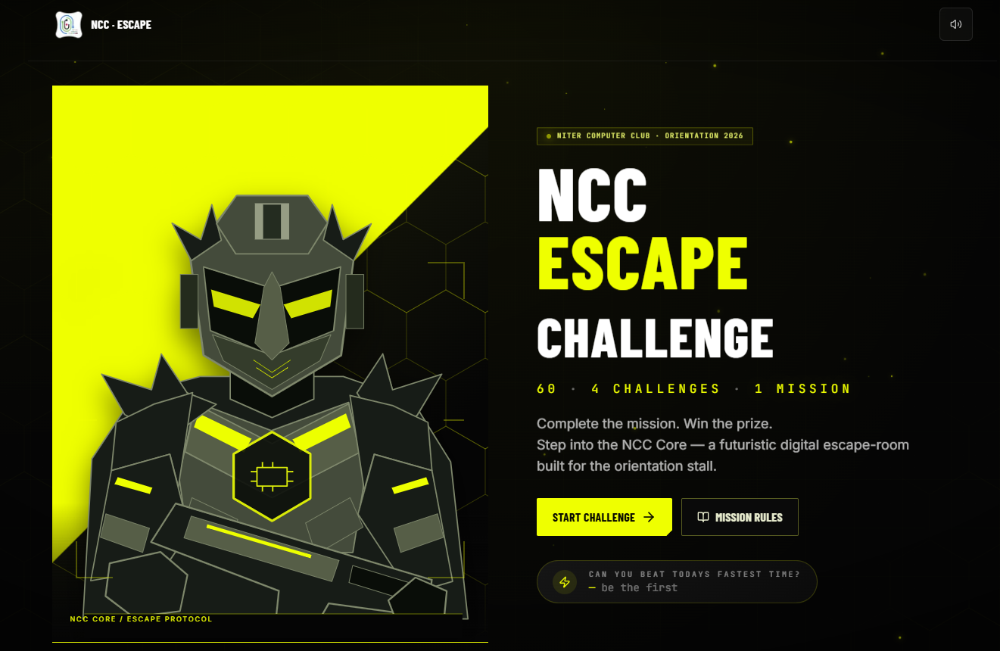
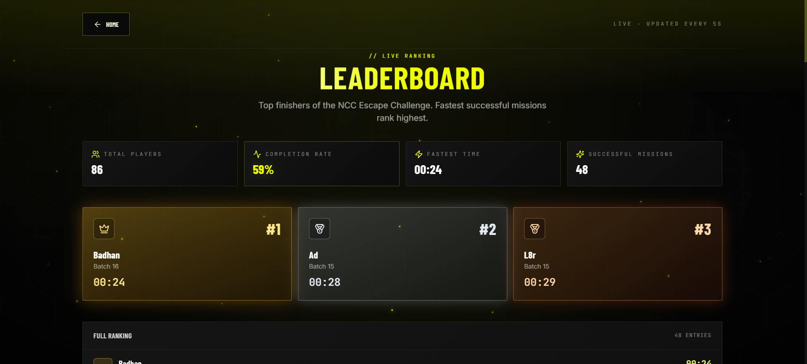
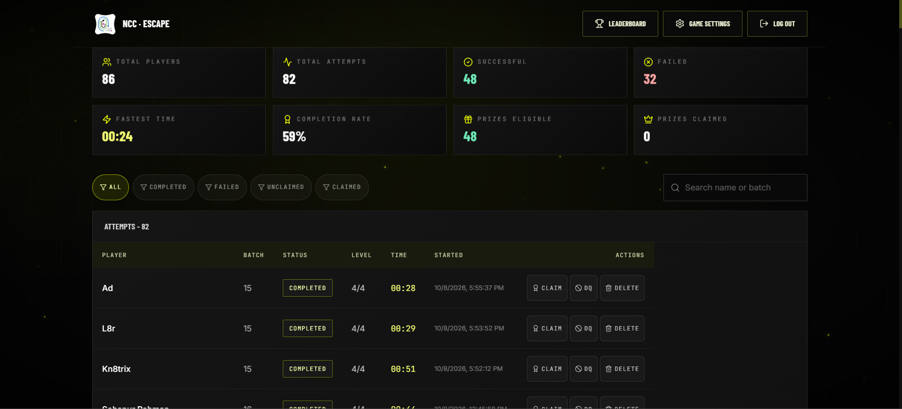

# NCC Escape Challenge

A futuristic interactive escape-room web game built for the **NITER Computer Club (NCC)** orientation stall. Participants register, scan a QR code (or open the URL), and race through **4 levels** in **120 seconds** to win a prize.

> **Complete the mission = Win a prize.**
> Fastest successful missions rank highest on the live leaderboard.

The experience is deliberately designed to feel like a small premium web game — animated grids, neon glow, glassmorphism, and server-authoritative timing so the timer cannot be cheated.

---

## Live demo

[Play NCC Escape Challenge](https://ncc-escape-challenge.vercel.app/)

## Screenshots

### Landing page



### Live leaderboard



### Admin dashboard



---
## Highlights

- Cinematic landing page, animated NCC emblem, ambient particle effects
- 4 fully-interactive levels with random puzzle selection per attempt
  1. **Signal Discovery** — discover a 4-digit access code hidden in a futuristic workspace
  2. **Logic Sequence** — solve sequences, matrices, symbols, or binary patterns
  3. **System Repair** — order steps, pair protocols, or pick the right component
  4. **NCC Core Vault** — enter the deterministic Master Access Key to unlock
- Server-authoritative timer (uses `startedAt` server timestamp; refresh does not reset)
- Per-attempt puzzle seed (every player gets a fresh, fair challenge)
- Lives system, sequential level validation, server-validated answers
- Live auto-updating leaderboard (polling-based; can be swapped for SSE/WebSocket)
- Polished admin panel with attempt/participant management, filters, and game control
- Downloadable / shareable result card (SVG export, no external libs)
- Optional WebAudio synth SFX (no audio assets to ship — fully self-contained)
- Mobile-first responsive layouts, keyboard & screen-reader friendly, reduced-motion aware
- Production-ready: zero TypeScript errors, clean `next build`, Vercel-ready

---

## Tech stack

- **Next.js 14** (App Router) + **React 18** + **TypeScript**
- **Tailwind CSS** + custom design tokens
- **Framer Motion** for animation
- **Lucide React** for icons
- **Appwrite** (self-hosted or cloud) — database + permissions
- **Vercel** for hosting (no extra backend required — Next.js Route Handlers handle everything)

When `APPWRITE_API_KEY` is missing, the app falls back to an in-memory store so the rest of the game remains demoable in local dev.

---

## Quick start (local)

```bash
# 1. Install dependencies
npm install

# 2. Copy env example
cp .env.example .env.local

# 3. (optional) Edit .env.local with your Appwrite credentials.
#    Without credentials the app uses an in-memory store.

# 4. Start dev server
npm run dev
# -> http://localhost:3000
```

If you only want to play locally without setting up Appwrite, skip step 3 — the app will work but data resets on restart.

---

## Environment variables

See `.env.example`. The full set:

| Variable | Required? | Description |
|---|---|---|
| `NEXT_PUBLIC_APPWRITE_ENDPOINT` | prod | Appwrite endpoint (e.g. `https://cloud.appwrite.io/v1`) |
| `NEXT_PUBLIC_APPWRITE_PROJECT_ID` | prod | Appwrite project ID (also exposed to client) |
| `APPWRITE_API_KEY` | prod | Server-side API key (never exposed to browser) |
| `APPWRITE_DATABASE_ID` | prod | Appwrite database ID |
| `APPWRITE_COLLECTION_PARTICIPANTS` | prod | Collection ID for participants |
| `APPWRITE_COLLECTION_ATTEMPTS` | prod | Collection ID for game attempts |
| `APPWRITE_COLLECTION_SETTINGS` | prod | Collection ID for game settings |
| `ADMIN_PASSWORDS` | yes | Comma-separated list of admin passwords |
| `NEXT_PUBLIC_BASE_URL` | optional | Used for share links |

---

## Appwrite setup

Create an Appwrite project (cloud or self-hosted) and a database with **3 collections**. Below is the schema; the server applies these automatically when you save a record (Appwrite does not auto-create collections, you must create them by hand or with the Appwrite CLI).

### Collection: `participants`

| Attribute | Type | Required | Notes |
|---|---|---|---|
| `name` | string (60) | yes | |
| `studentId` | string (30) | yes | unique — used to prevent duplicate registrations |
| `department` | string (60) | yes | |
| `batch` | string (40) | yes | |
| `phone` | string (20) | no | |
| `createdAt` | datetime | auto | server-set |

Recommended index: `studentId` (unique).

### Collection: `gameAttempts`

| Attribute | Type | Required | Notes |
|---|---|---|---|
| `participantId` | string | yes | FK to participants.$id |
| `participantName` | string | yes | denormalised for fast list rendering |
| `participantBatch` | string | yes | denormalised |
| `startedAt` | datetime | no | set when player presses BEGIN MISSION |
| `completedAt` | datetime | no | set when status becomes COMPLETED/FAILED |
| `status` | string (enum) | yes | READY / ACTIVE / COMPLETED / FAILED / DISQUALIFIED |
| `currentLevel` | int | yes | 1-4 |
| `livesRemaining` | int | yes | |
| `completionTimeMs` | int | no | authoritative server time |
| `prizeEligible` | bool | yes | |
| `prizeClaimed` | bool | yes | |
| `score` | int | yes | |
| `levelSeed` | int | yes | used to re-derive the per-attempt puzzle plan |
| `levelResults` | string (json) | yes | per-level attempts/passed |
| `createdAt` | datetime | auto | |

Recommended indexes:
- `participantId` (ascending)
- `status` (ascending) + `completedAt` (descending) — for leaderboard
- `prizeEligible` + `prizeClaimed`

### Collection: `gameSettings`

This collection must contain exactly one document with `id = "singleton"`. The
`scripts/setup-collections.ts` script creates the singleton document with
sensible defaults. After that, the admin panel updates it in place.

| Attribute | Type | Required | Notes |
|---|---|---|---|
| `gameActive` | bool | yes | Pauses registrations if false |
| `durationSeconds` | int | yes | 120 by default |
| `startingLives` | int | yes | 3 by default |
| `retryAllowed` | bool | yes | |
| `maximumAttempts` | int | yes | |
| `leaderboardEnabled` | bool | yes | |
| `prizeMode` | bool | yes | |

### One-click bootstrap (recommended)

Instead of hand-creating each collection, run:

```bash
APPWRITE_DATABASE_ID=your_db_id APPWRITE_API_KEY=... \
  npx tsx scripts/setup-collections.ts
```

This creates the database (if missing), all 3 collections with the exact
attribute / index / permission schema above, and the `gameSettings`
singleton document. It is idempotent — re-running is safe.

You can also wire it through `pnpm setup:appwrite` once the env vars are in
`.env.local` (run with `pnpm setup:appwrite`).

### Permissions

The simplest setup is to grant your server API key full access. For stricter security, allow only:

- Server-side API key: full CRUD
- Clients (anonymous role): no access

This is what we recommend because all writes go through the Next.js Route Handlers with the server API key. The browser never talks to Appwrite directly except via our own API.

---

## Admin

- URL: `/admin`
- Default password: `admin123` (configurable via `ADMIN_PASSWORDS` env var)
- The cookie is HTTP-only and lasts 8 hours.

### Features

- Live stats (total players, attempts, successful missions, completion rate, fastest time, prizes eligible/claimed/remaining)
- Attempts table with filters (all / completed / failed / claimed / unclaimed) + search
- Actions per attempt: Mark Claimed, Unclaim, Disqualify, Delete
- Participants table (student IDs and phone numbers are kept private — never shown on the leaderboard)
- Game Control panel: pause/resume, change duration, starting lives, max attempts, retry, leaderboard visibility, prize mode
- Auto-refreshes every 7 seconds

---

## Game flow (per attempt)

1. **Landing page** (`/`) — animated hero, mission rules modal, fastest-time card
2. **Registration** (`/` after `Start Challenge`) — name, student ID, department, batch, optional phone
3. **Ready screen** (`/play/[id]`) — confirms identity, shows duration, lives, levels
4. **BEGIN MISSION** — server stamps `startedAt`, status -> ACTIVE
5. **HUD** — player name, level, lives, live timer (warning <30s, critical <10s), progress bar
6. **Level 1 → 4** — each solved server-side; wrong answer costs a life
7. **Success or Failure screen**:
   - **Success** -> `prizeEligible = true`, leaderboard rank computed
   - **Failure** (time up / no lives) -> `prizeEligible = false`
8. **Result card** (`/result/[id]`) — shareable SVG download
9. **Leaderboard** (`/leaderboard`) — top finishers with podium styling

### Anti-cheat

- Server-authoritative timer (`startedAt` timestamp + `durationSeconds`)
- Sequential level validation (`currentLevel` must match submitted `level`)
- Attempts end on `COMPLETED` / `FAILED` (terminal states)
- Server-side puzzle selection via per-attempt seed
- Client never receives correct answers until submission
- Wrong submission doesn't reveal anything except "invalid"

---

## URL routes

| Path | Description |
|---|---|
| `/` | Landing page |
| `/play/[id]` | Ready screen + in-game shell for an attempt |
| `/result/[id]` | Result card for a completed or failed attempt |
| `/leaderboard` | Public leaderboard (auto-updates every 5s) |
| `/admin` | Admin login |
| `/admin/dashboard` | Admin dashboard (requires session cookie) |
| `/api/register` | Register a new participant |
| `/api/attempt/start` | Start (or resume) an attempt, returns the attempt + per-level puzzles |
| `/api/attempt/submit` | Submit a level answer; returns pass/fail and updated attempt |
| `/api/attempt/fail` | Mark attempt as failed (called by client when timer expires) |
| `/api/attempt` | Read attempt by id |
| `/api/leaderboard` | Public leaderboard + stats |
| `/api/admin/login` | POST password, sets HTTP-only cookie |
| `/api/admin/logout` | Clear session cookie |
| `/api/admin/stats` | Admin-only stats, attempts, participants |
| `/api/admin/settings` | Admin-only settings GET/POST |
| `/api/admin/action` | Admin-only attempt actions (mark_claimed, disqualify, delete, ...) |

---

## Deploy to Vercel

For optional Upstash Redis caching, rate limiting, environment variables and
verification steps, see [Redis integration](docs/redis-integration.md).

1. Push this repo to GitHub.
2. Import the project in [vercel.com/new](https://vercel.com/new).
3. Set the environment variables (Project Settings → Environment Variables):
   - `NEXT_PUBLIC_APPWRITE_ENDPOINT`
   - `NEXT_PUBLIC_APPWRITE_PROJECT_ID`
   - `APPWRITE_API_KEY`
   - `APPWRITE_DATABASE_ID`
   - `APPWRITE_COLLECTION_PARTICIPANTS`
   - `APPWRITE_COLLECTION_ATTEMPTS`
   - `APPWRITE_COLLECTION_SETTINGS`
   - `ADMIN_PASSWORDS` (e.g. `admin123,anotherPassword`)
   - `NEXT_PUBLIC_BASE_URL` (your Vercel URL)
4. Deploy. `npm install && npm run build` runs automatically.
5. Open the deployed URL. Done.

---

## Adding more puzzles

The puzzle datasets live in `data/puzzles/levelN.ts`. Each file exports an array of puzzles. Adding a new puzzle is as simple as appending an entry — no other code changes needed.

```ts
// data/puzzles/level1.ts
export const LEVEL1_PUZZLES: SignalScene[] = [
  ...existing,
  {
    id: "l1-new-puzzle",
    title: "...",
    briefing: "...",
    accessCode: "1234",
    objects: [ ... ],
  },
];
```

The `seed` is randomised per attempt, so different participants see different puzzles.

---

## Project layout

```
NCC_Game/
├── app/
│   ├── page.tsx                # Landing
│   ├── layout.tsx
│   ├── globals.css
│   ├── play/[id]/page.tsx      # Game shell
│   ├── result/[id]/page.tsx    # Result card
│   ├── leaderboard/page.tsx
│   ├── admin/page.tsx          # Admin login
│   ├── admin/dashboard/page.tsx
│   └── api/                    # Route Handlers
├── components/
│   ├── ui/                     # Toast, Modal, LoadingPanel
│   ├── effects/               # BackgroundFX, Emblem, CountUp
│   └── game/                  # HUD, levels, registration, ready/success/failure
├── data/puzzles/              # Level 1-4 puzzle datasets
├── hooks/useAudio.ts
├── lib/
│   ├── appwrite/              # Appwrite client + server helpers + in-memory fallback
│   ├── game/                  # engine + attempt-service (server-authoritative logic)
│   ├── security/session.ts    # Admin cookie helpers
│   ├── utils.ts
│   └── validation/schemas.ts  # Zod schemas
├── scripts/smoke.ps1          # Local API smoke test
├── types/index.ts
├── tailwind.config.ts
├── next.config.mjs
└── package.json
```

---

## Local smoke test

While the dev server is running:

```bash
powershell -ExecutionPolicy Bypass -File scripts/smoke.ps1
```

This registers a participant, starts an attempt, submits a wrong Level 1 answer (verifies lives decrement), and probes the leaderboard + admin auth.

---

## License

Caching and concurrency changes: [performance optimization report](docs/performance-optimization.md).

MIT. Built for the NITER Computer Club. Have fun at the stall! 🚀
